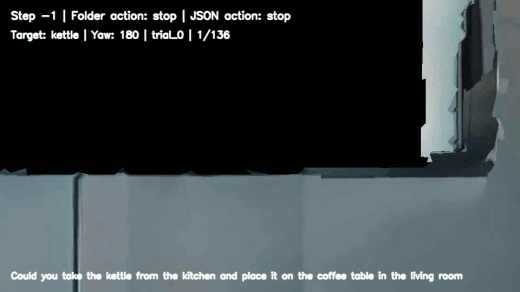

# LHPR-VLN HM3D Replay

A lightweight Habitat-Sim replay tool for visualizing **LHPR-VLN long-horizon navigation instructions** inside **HM3D scenes**.

This project loads an LHPR-VLN task, reads the saved trajectory pose data from `task.json`, places a simple Habitat agent inside the corresponding HM3D scene, and replays the robot movement using the saved position and yaw values.

The current focus is **dataset understanding and trajectory visualization**, not model inference or training.

---

## Demo



```text
Instruction:
Could you take the kettle from the kitchen and place it on the coffee table in the living room
```

---

## Repository Name

```text
lhpr-vln-hm3d-replay
```

---

## Repository Description

```text
A lightweight Habitat-Sim replay tool for visualizing LHPR-VLN instructions and saved trajectories inside HM3D scenes.
```

---

## Project Goal

The goal of this project is to understand how a long-horizon VLN instruction is executed inside an HM3D environment.

Example instruction:

```text
Could you take the kettle from the kitchen and place it on the coffee table in the living room
```

The system follows this pipeline:

```text
Load LHPR-VLN task
↓
Load HM3D scene and navmesh
↓
Read saved position/yaw/action data from task.json
↓
Set the Habitat agent pose directly at each step
↓
Render the trajectory in a viewer window
```

---

## Current Features

- Loads LHPR-VLN task configuration from YAML files
- Loads HM3D `.basis.glb` scene files
- Loads HM3D `.basis.navmesh` navigation mesh files
- Reads LHPR-VLN `config.json`
- Reads LHPR-VLN `task.json`
- Reads step-task JSON files
- Reads and sorts action-step folders
- Checks RGB-D image availability
- Detects duplicate action-step numbers
- Replays saved trajectory using `task.json` position and yaw values
- Supports yaw correction using `yaw_sign` and `yaw_offset`
- Compares Habitat-rendered frames against dataset `front.png` images

---

## What This Project Does

This project performs **pose-based trajectory replay**.

Instead of predicting actions using a model, it uses the saved ground-truth trajectory from the LHPR-VLN dataset.

```text
task.json position + yaw
↓
Habitat agent pose
↓
Rendered scene frame
```

This allows us to visualize how the instruction is executed inside the HM3D scene.

---

## What This Project Does Not Do Yet

- No VLN model inference
- No model training
- No LLM/CoT reasoning yet
- No visible Spot robot body
- No URDF-based robot simulation
- No physical robot deployment

The current agent is a simple first-person Habitat navigation agent.

---

## Current Folder Structure

```text
LHVLN_scene/
│
├── README.md
├── .gitignore
├── pyproject.toml
├── requirements.txt
├── open_hm3d_viewer.sh
├── lhpr_batch6_matched_local_scenes.txt
│
├── configs/
│   ├── paths/
│   │   └── local.yaml
│   │
│   ├── simulator/
│   │   └── habitat_rgb.yaml
│   │
│   └── replay/
│       └── batch6_kettle_task.yaml
│
├── src/
│   └── lhpr_vln/
│       ├── __init__.py
│       ├── config.py
│       ├── task_loader.py
│       ├── action_loader.py
│       ├── pose_loader.py
│       ├── habitat_replay.py
│       └── habitat_pose_replay.py
│
├── scripts/
│   ├── check_configs.py
│   ├── check_task_loading.py
│   ├── run_pose_replay.py
│   ├── run_replay.py
│   └── verify_pose_against_dataset.py
│
├── examples/
│   ├── check_batch6_subtask_counts.py
│   ├── check_exact_lhpr_instruction.py
│   ├── check_lhpr_zip_sizes.py
│   ├── download_lhpr_batch.py
│   ├── extract_lhpr_matched_task_info.py
│   ├── find_lhpr_scene_files.py
│   ├── find_tasks_with_local_scenes.py
│   ├── list_lhpr_files.py
│   └── render_hm3d_scene.py
│
├── tools/
│   ├── check_task_integrity.py
│   ├── extract_task_report.py
│   └── find_tasks_with_local_scenes.py
│
├── notes/
│   ├── hm3d_dataset_explanation.md
│   └── lhpr_dataset_understanding.md
│
├── data/
│   ├── lhpr_extracted/
│   └── scene_datasets/
│
└── outputs/
    ├── frames/
    ├── reports/
    ├── replay_videos/
    ├── verification/
    └── lhpr_task_reports/
```

---

## Folder And File Purpose

| Path | Purpose |
|---|---|
| `open_hm3d_viewer.sh` | Opens an HM3D scene in the Habitat interactive viewer |
| `lhpr_batch6_matched_local_scenes.txt` | Notes the Batch 6 tasks that match locally available HM3D scenes |
| `configs/` | YAML configuration files for local paths, simulator settings, and selected replay task |
| `src/lhpr_vln/` | Main Python package for loading LHPR tasks, loading poses, and replaying trajectories in Habitat |
| `scripts/` | Runnable project scripts for validation, replay, and visual verification |
| `examples/` | Exploratory scripts used for downloading, inspecting, matching, and understanding LHPR/HM3D data |
| `tools/` | Small helper utilities for checking task integrity and extracting reports |
| `notes/` | Learning notes about HM3D and LHPR-VLN dataset structure |
| `data/` | Local dataset location. This is ignored by Git because the files are large |
| `outputs/` | Generated reports, frames, videos, and verification images |

---

## Dataset Requirements

This repository does **not** include the LHPR-VLN dataset or HM3D scenes.

You must download them separately and place them under:

```text| `README.md` | Main project explanation, setup notes, and usage guide |
| `.gitignore` | Prevents large datasets, generated outputs, caches, and environment files from being committed |
| `pyproject.toml` | Python package metadata and editable-install configuration |
| `requirements.txt` | Lightweight dependency list for quick setup |
data/lhpr_extracted/
data/scene_datasets/hm3d/
```

Expected LHPR-VLN structure:

```text
data/lhpr_extracted/
├── task/
├── step_task/
└── episode_task/
```

Expected HM3D structure for the current example:

```text| `README.md` | Main project explanation, setup notes, and usage guide |
| `.gitignore` | Prevents large datasets, generated outputs, caches, and environment files from being committed |
| `pyproject.toml` | Python package metadata and editable-install configuration |
| `requirements.txt` | Lightweight dependency list for quick setup |
data/scene_datasets/hm3d/val/00843-DYehNKdT76V/
├── DYehNKdT76V.basis.glb
├── DYehNKdT76V.basis.navmesh
├── DYehNKdT76V.semantic.glb
└── DYehNKdT76V.semantic.txt
```

---

## Example Task Used

The current configured task is from LHPR-VLN Batch 6.

```text
Instruction:
Could you take the kettle from the kitchen and place it on the coffee table in the living room

Scene:
00843-DYehNKdT76V

Robot:
spot

Subtasks:
Move_to('kettle_8')
Grab('kettle')
Move_to('coffee table_7')
Release('kettle')
```

The current replay uses a simple Habitat agent, not a visible Spot URDF robot.

---

## Installation

Activate your Habitat environment:

```bash
conda activate habitat-display
```

Install the project in editable mode:

```bash
pip install -e .
```

If needed, install required Python packages:

```bash
pip install pyyaml opencv-python numpy
```

Habitat-Sim should already be installed in the active environment.

---

## Configuration Files

The project uses YAML configuration files instead of hardcoding paths in Python scripts.

---

### 1. Local Paths Config

File:

```text
configs/paths/local.yaml
```

Example:

```yaml
project_root: "."

lhpr_task_root: "data/lhpr_extracted/task"
lhpr_step_task_root: "data/lhpr_extracted/step_task"
lhpr_episode_task_root: "data/lhpr_extracted/episode_task"

hm3d_root: "data/scene_datasets/hm3d"

output_root: "outputs"
report_root: "outputs/reports"
frame_root: "outputs/frames"
video_root: "outputs/replay_videos"
```

This file stores dataset and output paths.

---

### 2. Habitat Simulator Config

File:

```text
configs/simulator/habitat_rgb.yaml
```

Example:

```yaml
agent:
  height: 1.25

sensor:
  rgb:
    enabled: true
    uuid: "color_sensor"
    width: 960
    height: 540
    position: [0.0, 1.25, 0.0]

actions:
  move_forward:
    amount: 0.25

  turn_left:
    amount: 30.0

  turn_right:
    amount: 30.0

viewer:
  window_name: "LHPR-VLN Habitat Replay"
  fps: 5
  show_text_overlay: true
```

This file controls the Habitat RGB sensor, viewer window, and basic action settings.

Even though pose-based replay does not depend on the action step sizes for movement, these settings are still useful for simulator setup and future action-based experiments.

---

### 3. Replay Task Config

File:

```text
configs/replay/batch6_kettle_task.yaml
```

Example:

```yaml
name: "batch6_kettle_to_coffee_table"

batch: "batch_6"
category: "2"

instruction: "Could you take the kettle from the kitchen and place it on the coffee table in the living room"

task_dir: "data/lhpr_extracted/task/batch_6/2/Could you take the kettle from the kitchen and place it on the coffee table in the living room"

scene:
  scene_id: "00843-DYehNKdT76V"
  glb: "data/scene_datasets/hm3d/val/00843-DYehNKdT76V/DYehNKdT76V.basis.glb"
  navmesh: "data/scene_datasets/hm3d/val/00843-DYehNKdT76V/DYehNKdT76V.basis.navmesh"

robot:
  type: "simple_habitat_agent"
  use_urdf: false

start:
  position: [-3.6155807971954346, 3.3365070819854736, -5.284048080444336]
  yaw: -90

replay:
  source: "action_folders"
  trial_folder: "success/trial_1"
  skip_initial_stop: false
  skip_stop_actions: false
  save_video: false
  save_frames: false

pose_replay:
  source: "task_json"
  yaw_sign: 1.0
  yaw_offset: 180.0
```

The `yaw_offset` may need to be adjusted depending on the dataset and Habitat camera convention.

For this task, `yaw_offset: 180.0` was used because the rendered camera direction was initially reversed.

---

## Usage

### 1. Check Config Files

Run:

```bash
python scripts/check_configs.py
```

This verifies that:

```text
YAML files can be loaded
task_dir exists
config.json exists
success/trial_1 exists
task.json exists
HM3D .basis.glb exists
HM3D .basis.navmesh exists
```

Expected final result:

```text
All required config paths are valid.
```

---

### 2. Check LHPR Task Loading

Run:

```bash
python scripts/check_task_loading.py
```

This checks:

```text
config.json
task.json
step-task JSONs
action-step folders
RGB-D image availability
duplicate step numbers
step-task ranges
```

Example output:

```text
Expected Move_to subtasks:
2

Actual step-task JSON count:
2

Total action folders:
136

All action folders contain required RGB-D images.
```

---

### 3. Run Pose-Based Replay

Run:

```bash
python scripts/run_pose_replay.py
```

If the viewer needs NVIDIA GPU offload:

```bash
__NV_PRIME_RENDER_OFFLOAD=1 __GLX_VENDOR_LIBRARY_NAME=nvidia python scripts/run_pose_replay.py
```

This opens a Habitat viewer and replays the saved LHPR-VLN trajectory using `task.json` position and yaw values.

---

### 4. Verify Replay Against Dataset Images

Run:

```bash
python scripts/verify_pose_against_dataset.py
```

This compares:

```text
Habitat-rendered frame from task.json pose
vs
Dataset saved front.png
```

The output images are saved under:

```text
outputs/verification/
```

Use these side-by-side images to confirm whether the pose and yaw are aligned correctly.

---

## Why Pose-Based Replay?

At first, trajectory replay was attempted using only action folders:

```text
move_forward
turn_left
turn_right
stop
```

However, this caused path drift because small differences in:

```text
movement step size
turn angle
yaw convention
camera direction
duplicate action steps
```

can accumulate over a long trajectory.

The better method is:

```text
Read task.json positions/yaw
↓
Set the agent pose directly
↓
Render the scene
```

This follows the saved dataset trajectory more accurately.

---

## Current Pipeline

```text
LHPR-VLN task folder
↓
config.json
↓
task.json
↓
position + yaw + action
↓
HM3D scene + navmesh
↓
Habitat simple agent
↓
pose-based replay
↓
visual verification
```

---

## Main Files

| File | Purpose |
|---|---|
| `open_hm3d_viewer.sh` | Launches the Habitat viewer for an HM3D scene |
| `lhpr_batch6_matched_local_scenes.txt` | Records locally matched Batch 6 tasks and scene paths |
| `src/lhpr_vln/config.py` | Loads YAML config files and checks paths |
| `src/lhpr_vln/task_loader.py` | Loads LHPR task files such as `config.json`, `task.json`, and step-task JSONs |
| `src/lhpr_vln/action_loader.py` | Reads, parses, and sorts action-step folders |
| `src/lhpr_vln/pose_loader.py` | Reads and flattens position/yaw/action data from `task.json` |
| `src/lhpr_vln/habitat_replay.py` | Creates the Habitat simulator and loads scene/navmesh |
| `src/lhpr_vln/habitat_pose_replay.py` | Performs pose-based replay inside Habitat |
| `scripts/check_configs.py` | Validates YAML config files |
| `scripts/check_task_loading.py` | Validates LHPR task and action folders |
| `scripts/run_pose_replay.py` | Runs pose-based Habitat replay |
| `scripts/run_replay.py` | Earlier replay entry point kept for action-based replay experiments |
| `scripts/verify_pose_against_dataset.py` | Compares Habitat-rendered frames with saved dataset images |
| `examples/download_lhpr_batch.py` | Downloads selected LHPR-VLN dataset files |
| `examples/list_lhpr_files.py` | Lists files available in the LHPR-VLN dataset |
| `examples/check_lhpr_zip_sizes.py` | Checks LHPR archive sizes before downloading/extracting |
| `examples/find_lhpr_scene_files.py` | Searches LHPR task data for referenced scene IDs |
| `examples/find_tasks_with_local_scenes.py` | Finds LHPR tasks whose HM3D scenes exist locally |
| `examples/extract_lhpr_matched_task_info.py` | Extracts a compact report for a matched LHPR task |
| `examples/check_exact_lhpr_instruction.py` | Checks whether a specific instruction exists in the extracted data |
| `examples/check_batch6_subtask_counts.py` | Summarizes Batch 6 subtask counts |
| `examples/render_hm3d_scene.py` | Renders sample RGB views from an HM3D scene |
| `tools/check_task_integrity.py` | Helper for basic LHPR task folder integrity checks |
| `tools/extract_task_report.py` | Helper entry point for extracting task reports |
| `tools/find_tasks_with_local_scenes.py` | Helper entry point for matching tasks to local HM3D scenes |
| `notes/hm3d_dataset_explanation.md` | Study note explaining HM3D files and Habitat usage |
| `notes/lhpr_dataset_understanding.md` | Study note explaining LHPR-VLN Batch 6 structure |

---

## LHPR-VLN Task Structure

A full LHPR-VLN task folder contains:

```text
config.json
success/
└── trial_1/
    ├── task.json
    ├── step-task JSON files
    ├── 0_turn_left_for_kettle/
    ├── 1_turn_left_for_kettle/
    ├── ...
    └── 132_stop_for_coffee table/
```

---

### `config.json`

This contains the full long-horizon task instruction and symbolic subtasks.

Example:

```json
{
  "Task instruction": "Could you take the kettle from the kitchen and place it on the coffee table in the living room",
  "Subtask list": [
    "Move_to('kettle_8')",
    "Grab('kettle')",
    "Move_to('coffee table_7')",
    "Release('kettle')"
  ],
  "Robot": "spot",
  "Scene": "00843-DYehNKdT76V"
}
```

---

### Step-Task JSONs

Step-task JSON files describe individual navigation segments.

Example:

```text
Move forward through the hallway, and then turn left at the doorway, continue ahead into the room...
```

Each step-task JSON contains:

```text
target object
region
start step
end step
start position
start yaw
navigation instruction
```

---

### Action-Step Folders

Action folders are named like:

```text
5_move_forward_for_kettle
132_stop_for_coffee table
```

Each folder contains:

```text
front.png
left.png
right.png
depth_front.png
depth_left.png
depth_right.png
```

These are the saved visual observations from the dataset.

---

### `task.json`

`task.json` contains the saved trajectory information.

It includes:

```text
position
yaw
action
```

for each trajectory step.

This project uses `task.json` as the main source for replay.

---

## Handling Yaw Alignment

Sometimes the rendered Habitat view may face the wrong direction compared to the dataset image.

This can be adjusted in:

```text
configs/replay/batch6_kettle_task.yaml
```

Using:

```yaml
pose_replay:
  source: "task_json"
  yaw_sign: 1.0
  yaw_offset: 180.0
```

Useful options to try:

```yaml
yaw_sign: 1.0
yaw_offset: 0.0
```

```yaml
yaw_sign: 1.0
yaw_offset: 180.0
```

```yaml
yaw_sign: -1.0
yaw_offset: 0.0
```

```yaml
yaw_sign: -1.0
yaw_offset: 180.0
```

The correct setting is the one where the Habitat-rendered frame matches the dataset `front.png`.

---

## URDF / Robot Body Note

The current project does **not** require a robot URDF.

For this replay, the agent is:

```text
simple_habitat_agent
```

This means the replay shows a first-person camera moving through the scene.

A Spot URDF is only needed later if the project requires:

```text
visible Spot robot body
robot arm simulation
physics-based articulation
third-person robot visualization
manipulation simulation
```

For VLN trajectory visualization, the simple Habitat agent is enough.

---

## Current Limitations

- Only one selected Batch 6 instruction is configured
- No automatic multi-task replay yet
- No VLN model inference yet
- No training code yet
- No visible robot body
- No URDF support yet
- No video export yet
- Yaw alignment may require manual tuning

---

## Future Work

Possible next steps:

```text
Add support for multiple LHPR-VLN instructions
Add automatic task selection by available HM3D scene
Add replay video export
Add side-by-side replay with dataset RGB images
Add trajectory map visualization
Add predicted trajectory vs ground-truth comparison
Add long-horizon subtask progress visualization
Add LLM/CoT reasoning overlay
Add support for physical robot execution later
Add optional Spot/Unitree-style robot embodiment
```

---

## Recommended `.gitignore`

Use the following `.gitignore` to avoid pushing large datasets and outputs to GitHub:

```gitignore
# Python
__pycache__/
*.pyc
*.pyo
*.pyd
*.egg-info/
dist/
build/

# Virtual environments
.venv/
venv/
env/

# Conda
*.conda

# Data
data/lhpr_raw/
data/lhpr_extracted/
data/scene_datasets/

# Outputs
outputs/
archive/

# System files
.DS_Store
Thumbs.db

# IDE
.vscode/
.idea/

# Logs
*.log
```

---

## Repository Status

This is an early research utility for understanding the LHPR-VLN dataset structure and visualizing saved long-horizon navigation demonstrations inside HM3D scenes.

The project currently supports:

```text
one selected LHPR-VLN instruction
one matching HM3D scene
pose-based Habitat replay
dataset-image verification
```
